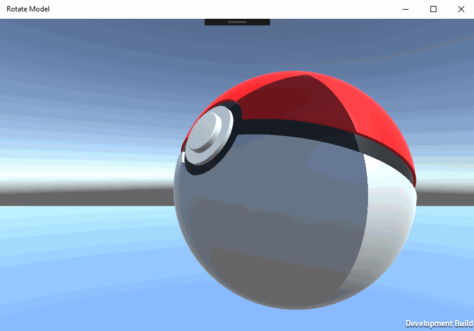
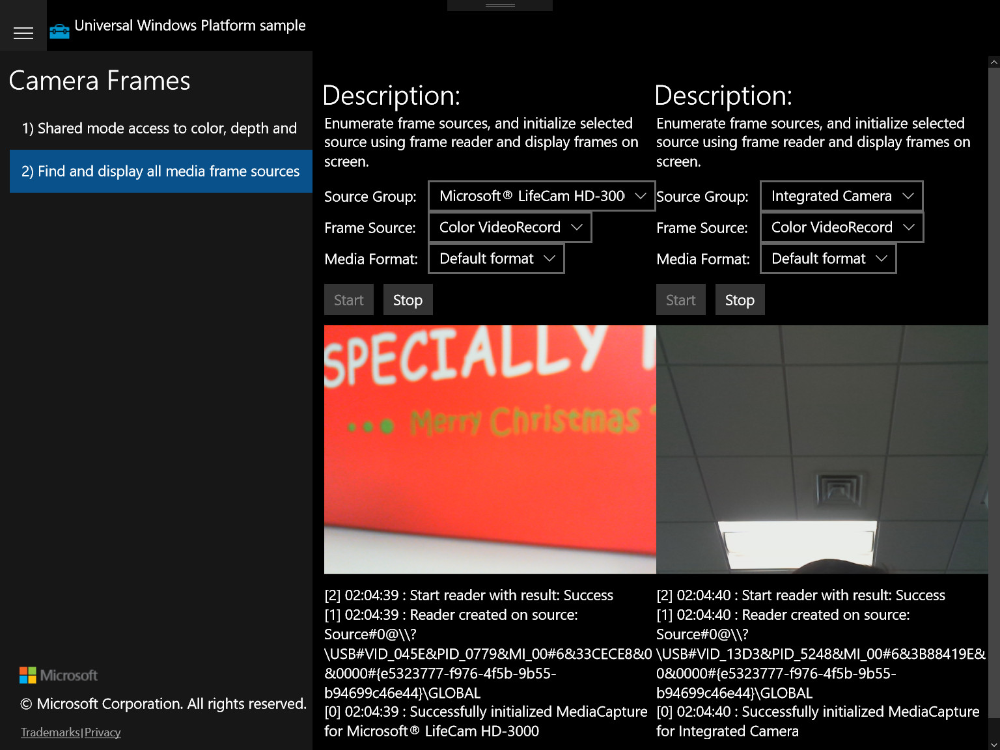

# UWP-Samples
Samples for Windows 10 Universal Platform

## Sample List

<table>
 <tr>
  <td><a href="AdClientUWPApp">AdClient UWP Demo</a></td>
  <td><a href="GridViewMVVMApp1">GridView MVVM Demo</a></td>
  <td><a href="ListBoxContextMenuUWPApp1">ListBox ContextMenu UWP Demo</a></td>
 </tr>
 <tr>
  <td><a href="ListViewMVVMUWPApp1">ListView MVVM UWP Demo</a></td>
  <td><a href="ListViewRichEditBoxApp1">ListView RichEditBox Demo</a></td>
  <td><a href="MVVMCrossUWPApp1">MVVMCross UWP Demo</a></td>
 </tr>
 <tr>
  <td><a href="MediaCaptureVCSApp">MediaCapture UWP C# Demo</a></td>
  <td><a href="MediaCaptureWinjsApp">MediaCapture UWP WINJS Demo</a></td>
  <td><a href="MvvmVisualStatesBehaviorUWPApp1">Mvvm VisualStatesBehavior UWP Demo</a></td>
 </tr>
 <tr>
  <td><a href="MyToolkitDataGridUWPApp1">MyToolkit DataGrid UWP Demo</a></td>
  <td><a href="NavigationUWPApp2">Navigation UWP Demo</a></td>
  <td><a href="RelativePanelUWPApp1">RelativePanel UWP Demo</a></td>
 </tr>
 <tr>
  <td><a href="RotateModelUnityUWP">Rotate Model Unity UWP Demo</a></td>
  <td><a href="SemanticZoomUWPApp1">SemanticZoom UWP Demo</a></td>
  <td><a href="StackPanelUWPApp1">StackPanel UWP Demo</a></td>
 </tr>
 <tr>
  <td><a href="TileBackgroundImageUWPApp">TileBackgroundImage UWP Demo</a></td>
  <td><a href="TitleBarApp1">TitleBar UWP Demo</a></td>
  <td><a href="AppServiceBridgeSample">AppService Bridge Sample</a></td>
 </tr>
 <tr>
  <td><a href="UWPCreateCurCPPAPP1">UWP Create Cursor Demo</a></td>
  <td><a href="WorkingWithListview">The workaround for Editor scroll issue inside Xamarin ListView</a></td>
  <td><a href="WebViewCustomHeaderUWPApp1">Custom header for WebView Demo</a></td>
 </tr>
 <tr>
  <td><a href="AudioGraphBackgroundPlayback">AudioGraph Background Playback UWP Demo</a></td>
  <td><a href="WorkingWithImages">Xamarin UWP: Save image from ImageSource</a></td>
  <td><a href="WinRTXamlToolkitChartingVBApp1">WinRTXamlToolkitCharting VB.net sample</a></td>
 </tr>
 <tr>
  <td><a href="MultipleCameraFrames">Multiple Camera Frames UWP Demo</a></td>
 </tr>
</table>

## Screenshot for some samples:

### [RotateModelUnityUWP](RotateModelUnityUWP)

### [MultipleCameraFrames](MultipleCameraFrames)

